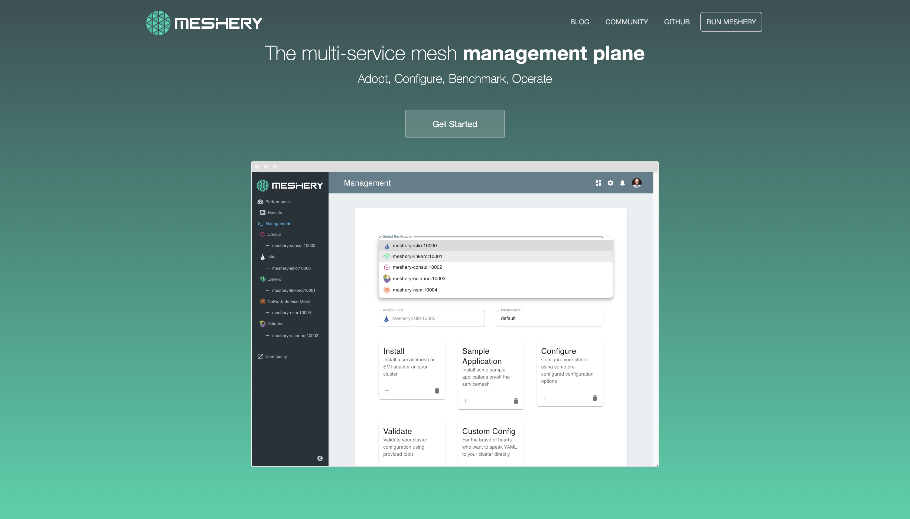

# Meshery


*Visit [Meshery.io](https://meshery.io/) to learn more!*

## What is Meshery?
Meshery is a multi-service mesh management plane adopting, operating, and developing on different service meshes. Meshery facilitates learning about functionality and performance of service meshes. It incorporates the collection and display of metrics from applications running on or across service meshes. At a high level, Meshery provides performance benchmarking, service mesh lifecycle management, and service mesh interoperability and federation.

For further information, refer to the [Meshery Docs](https://docs.meshery.io).


<div>&nbsp;</div>

## Join the service mesh community!

<a name="contributing"></a><a name="community"></a>
Our projects are community-built and welcome collaboration. 👍 Be sure to see the <a href="https://docs.google.com/document/d/17OPtDE_rdnPQxmk2Kauhm3GwXF1R5dZ3Cj8qZLKdo5E/edit">Layer5 Community Welcome Guide</a> for a tour of resources available to you and jump into our <a href="http://slack.layer5.io">Slack</a>!

<p style="clear:both;">
<a href ="https://layer5.io/community"></a>
<h3>Find your MeshMate</h3>

<p>MeshMates are experienced Layer5 community members, who will help you learn your way around, discover live projects and expand your community network. 
Become a <b>Meshtee</b> today!</p>

Find out more on the <a href="https://layer5.io/community#meshmate">Layer5 community</a>. <br />
<br /><br /><br /><br />
</p>

<a href="https://meshery.io/community"></a>

<a href="http://slack.layer5.io"></a>

<p>
✔️ <em><strong>Join</strong></em> any or all of the weekly meetings on the <a href="https://calendar.google.com/calendar/b/1?cid=bGF5ZXI1LmlvX2VoMmFhOWRwZjFnNDBlbHZvYzc2MmpucGhzQGdyb3VwLmNhbGVuZGFyLmdvb2dsZS5jb20">community calendar</a>.<br />
✔️ <em><strong>Watch</strong></em> community <a href="https://www.youtube.com/playlist?list=PL3A-A6hPO2IMPPqVjuzgqNU5xwnFFn3n0">meeting recordings</a>.<br />
✔️ <em><strong>Access</strong></em> the <a href="https://drive.google.com/drive/u/4/folders/0ABH8aabN4WAKUk9PVA">Community Drive</a> by completing a community <a href="https://layer5.io/newcomer">Member Form</a>.<br />
✔️ <em><strong>Discuss</strong></em> in the <a href="https://discuss.layer5.io">Community Forum</a>.<br />
<br />
</p>
<p align="center">
<i>Not sure where to start?</i> Grab an open issue with the <a href="https://github.com/issues?utf8=✓&q=is%3Aopen+is%3Aissue+archived%3Afalse+org%3Alayer5io+label%3A%22help+wanted%22+">help-wanted label</a>.
</p>

<div>&nbsp;</div>
<a name="contributing"></a>

## Contributing to the Meshery.io Website

Before contributing, please review the [Contribution Flow](https://github.com/layer5io/meshery/blob/master/CONTRIBUTING.md). In the following steps you will set up your development environment, fork and clone the repository, run the site locally, and finally commit, sign-off, and push any changes made for review.

### 1. Set up your development environment

* *The Meshery site is built using Jekyll - a simple static site generator! You can learn more about Jekyll and setting up your development environment in the [Jekyll Docs](https://jekyllrb.com/docs/).*

* First [install Ruby](https://jekyllrb.com/docs/installation/), then install Jekyll and Bundler.

### 2. Get the code

* Fork and then clone the [Meshery.io repository](https://github.com/layer5io/meshery.io)
  ```bash
  $ git clone https://github.com/YOUR-USERNAME/meshery.io
  ```
* Install any Ruby dependencies
  ```bash
  $ bundle install
  ```

### 3. Serve the site

* Serve the code locally
  ```bash
  $ make site
  ```
  *Note: From the Makefile, this command is actually running `$ bundle exec jekyll serve --drafts --livereload`*

### 4. Create a Pull Request

* After making changes, don't forget to commit with the sign-off flag (-s)!
  ```bash
  $ commit -s -m “my commit message w/signoff”
  ```
* Once all changes have been committed, push the changes.
  ```bash
  $ git push origin <branch-name>
  ```
* Then on Github, navigate to the [Meshery.io repository](https://github.com/layer5io/meshery.io) and create a pull request from your recently pushed changes!

#### License

This repository and site are available as open source under the terms of the [Apache 2.0 License](https://opensource.org/licenses/Apache-2.0).
